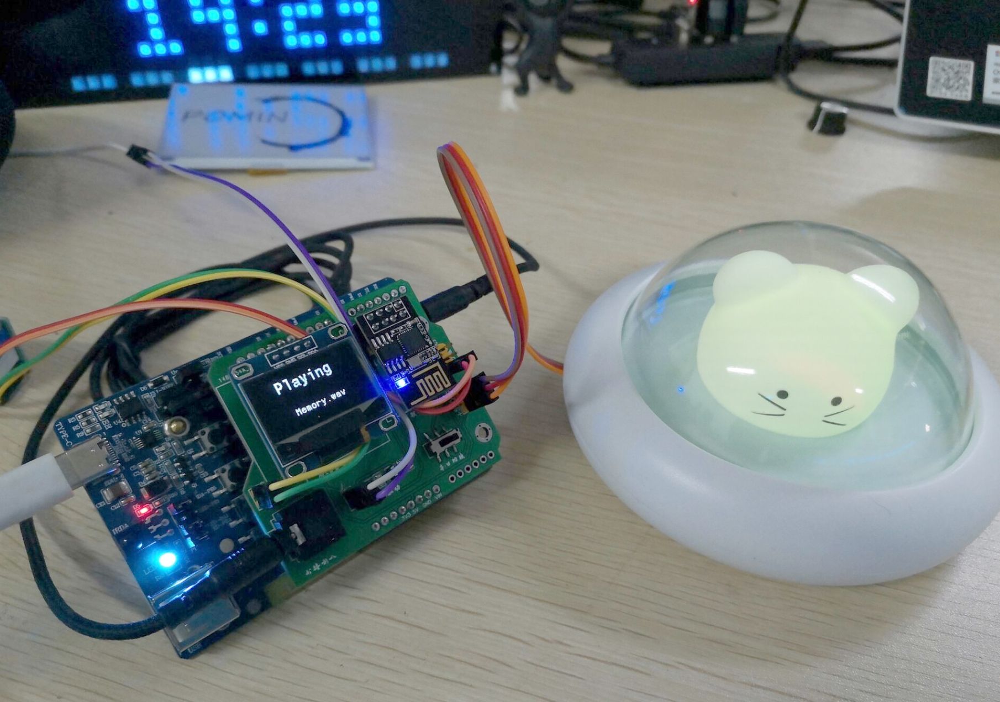
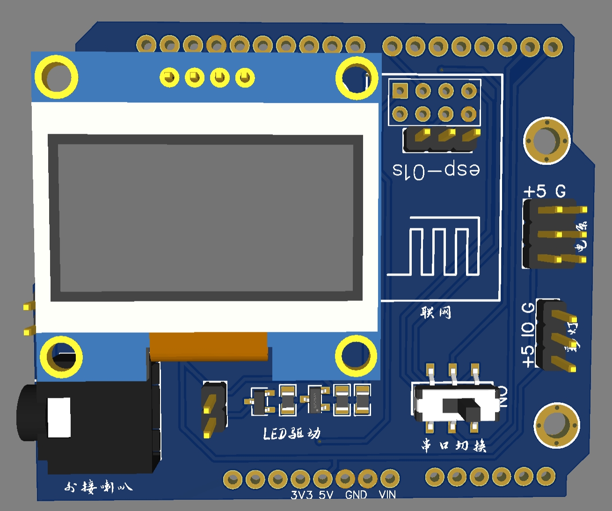
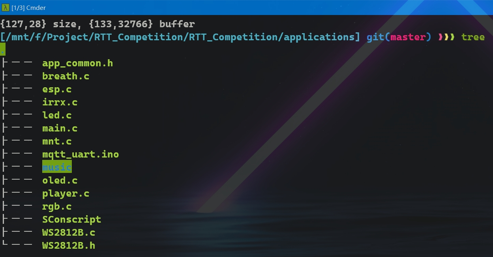
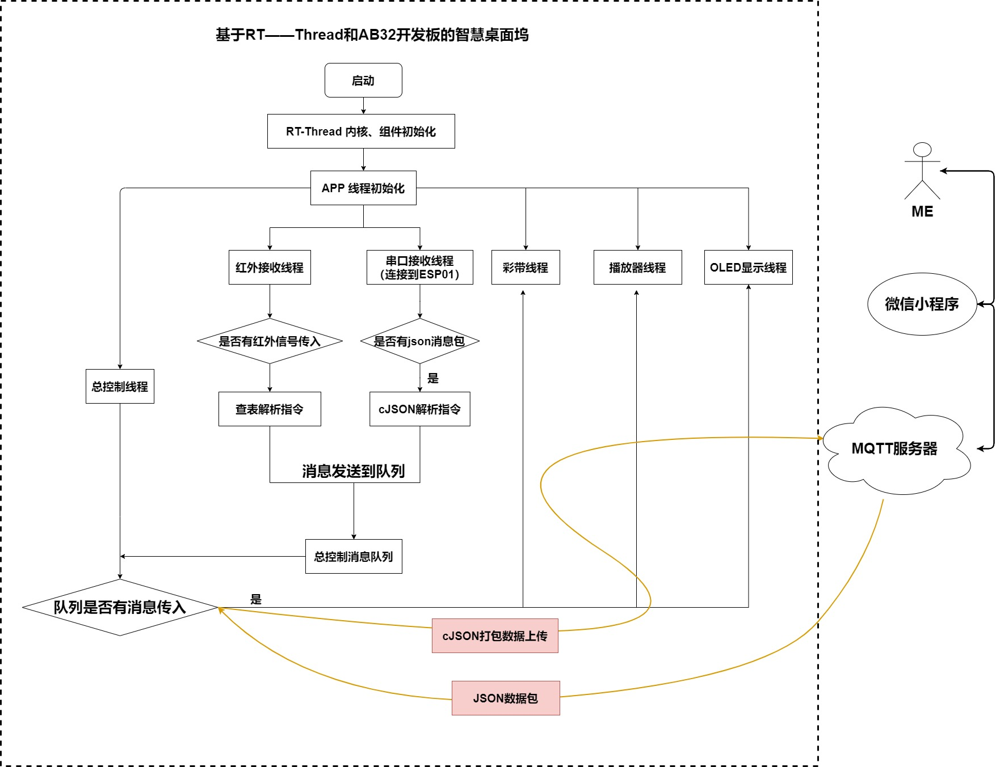

<!--
 * @Author: Pomin
 * @Date: 2021-11-28 11:04:32
 * @Github: https://github.com/POMIN-163
 * @LastEditTime: 2021-12-01 17:55:34
 * @Description:
-->
# RTT YYDS ！！！！！
## 一个桌面智能坞小工具
很荣幸能申请到AB32VG1开发板参加这次RTT的创新大赛，这个芯片的功能很强大。我基于这个开发板制作了一款桌面小工具一个小巧、功能丰富、具有实用价值的桌面物联网“控制中枢”。可以实现：

- 精灵播放音乐时内部有一颗呼吸灯的效果；
- 精灵可以通过OLED显示当前音乐名字、播放状态；
- 精灵可以自动连接到MQTT服务器，实现网络交互；
- 精灵可以通过红外遥控，实现音乐切换和暂停播放；
- 精灵可以通过手机连接热点配网，配置联网信息，连接 WIFI；
- 精灵连接有功放模块实现播放TF卡中的音乐；
- 精灵连接有一个rgb彩灯，在一个精致小夜灯中实现彩虹灯的效果；
- 精灵连接有一个灯管，实现联网控制灯管，冬天再也不用下床关灯了；
- 精灵配有自主设计的微信小程序端应用，通过MQTT服务器来实现和精灵的交互；

## <-- 硬件 -->

整个作品各项内容均由我一人完成，涉及的技术栈有：电路图、PCB 设计，基于RT-Thread Studio 编程，MQTT服务器端搭建，数据包收发的对接，微信小程序的编写等。通过这个作品，大大提高了我对于一个产品从设计到落地的整个过程，产品版本迭代重要性的认知。

### 实物照片

因为AB32的开发板兼容Arduino的接口，用Arduino的外形设计了一个pcb板。

### PCB的3D图

## <-- 软件 -->

软件主要分为几个线程
- 播放器线程：挂载sd卡、载入dfs文件系统，并搜索sd 卡中的音乐文件，检测接收队列来响应上一曲、下一曲、暂停、播放等消息
- 红外接收线程：检测红外信号
- 串口线程：连接到ESP-01S 实现网络交互
- OLED线程：对当前的播放状态和文件名进行显示
- 呼吸灯、rgb 彩灯线程：控制呼吸灯和rgb彩灯

> 有关这些的代码和音乐文件均放在/applications文件夹下

### 代码树

几个硬件设备都是分模块编写、耦合度较低，也较容易理解代码的用途。

整个软件的流程如下，主要是分为几个线程，通过RT-Thread来实现多线程的交互。网络端使用MQTT服务器来实现人机交互。

### 流程图

### 演示视频

### 代码地址
- gitee
[https://gitee.com/pomin-163/desktop_spirit](https://gitee.com/pomin-163/desktop_spirit)
- github

